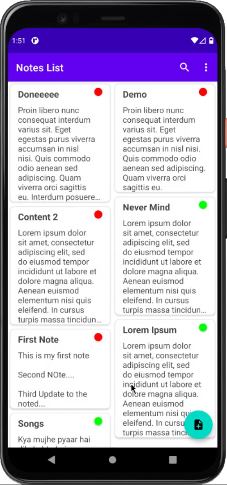
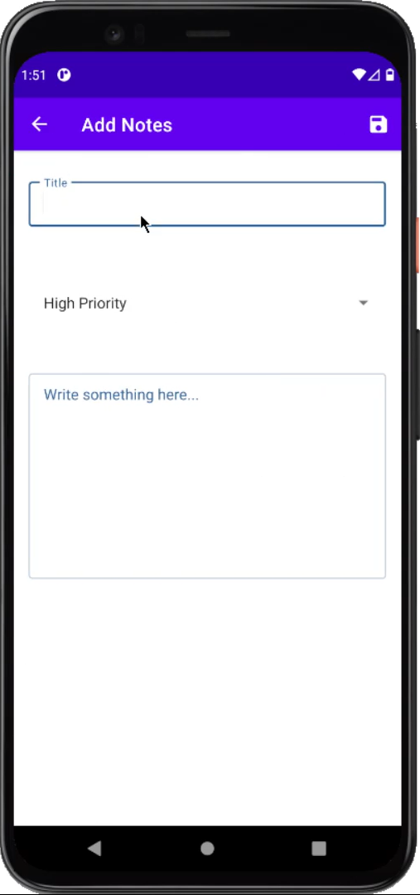
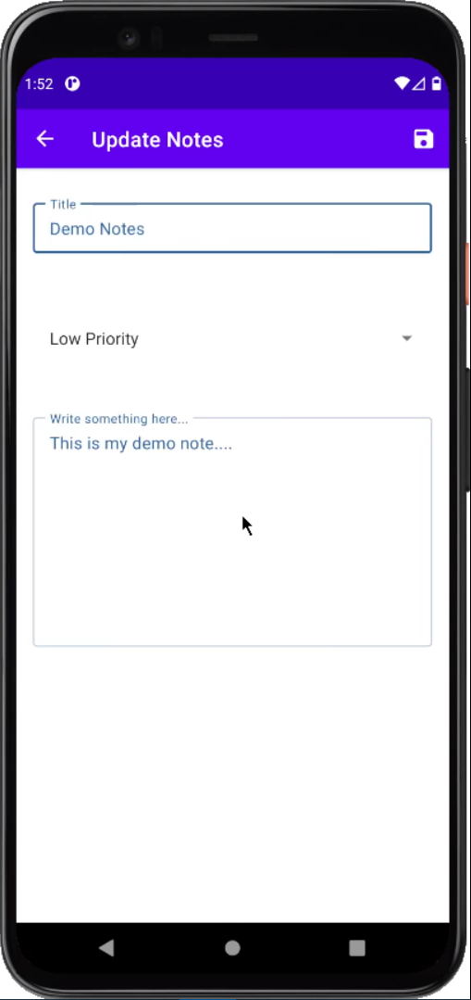

# Notepad

Notes app where user can add notes, assign priority to their notes, can delete and update their notes. These notes details are stored in Local SQLite Database.

<b>MVVM Clean Architecture</b> is used to create "Notepad" Android App.

### [Video Demo](https://drive.google.com/file/d/1vWIkLZ3rZWvttTZkw97hNB4CD9-EUEL-/view?usp=sharing)

## Screenshots

